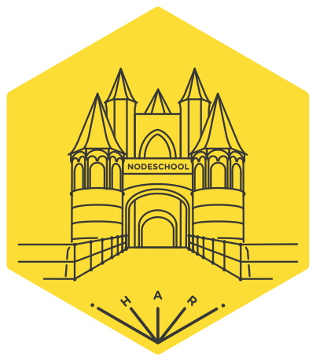

# NodeSchool Haarlem

Welcome to the NodeSchool Haarlem chapter's repository. We use this repository
for our website and almost all our communication.

You can see the website here: http://nodeschool.io/haarlem/

## Talk to us

You can chat with us on [Gitter](https://gitter.im/nodeschool/haarlem) and we
utilize [GitHub Issues](https://github.com/nodeschool/haarlem/issues) like a
message board and keep almost all of our communication in the open. If for any
reason you need to contact an organizer privately feel free to contact us
directly.

## Organizers

 * Davide Fiorello [GitHub](https://github.com/codeflyer/), [Twitter](https://twitter.com/davidefiorello/)
 * Rick Heere [GitHub](https://github.com/rickheere/),
 [Twitter](https://twitter.com/heererick/)
 * Stefan Mirck [GitHub](https://github.com/stefanmirck/),
 [Twitter](https://twitter.com/stefanmirck)
 * JP Wesselink [GitHub](https://github.com/jpwesselink),
 [Twitter](https://twitter.com/jp10k)
